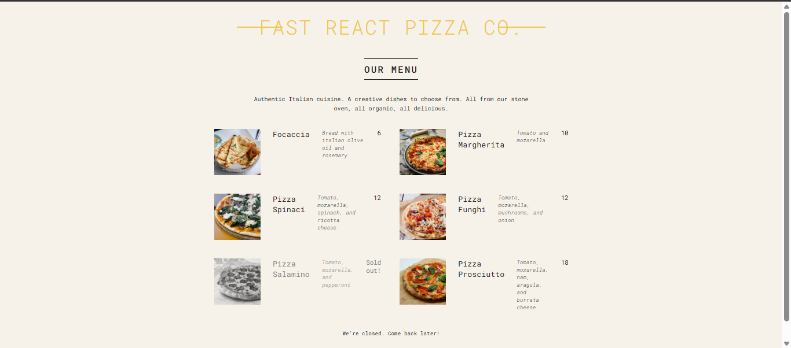

# 🍕 Fast React Pizza Menu

This is a simple and interactive pizza menu website built using **React**. It is inspired by the [Fast React Pizza Menu](https://fast-react-pizza-menu.netlify.app/) and showcases various pizza options dynamically.

## 🚀 Features

- Displays a menu of pizzas dynamically
- Interactive UI with React components
- Styled with CSS&#x20;
- Responsive design

## 🛠️ Technologies Used

- React.js
- JavaScript (ES6+)
- CSS

## 🎬 Demo



## 📌 Installation

1. Clone the repository:
   ```sh
   git clone https://github.com/ashutoshsitu02/pizza.git
   ```
2. Install dependencies:
   ```sh
   npm install
   ```
3. Start the development server:
   ```sh
   npm start
   ```
4. Open [http://localhost:3000](http://localhost:3000) in your browser.

## 📂 Project Structure

```
/react-pizza-menu
│── src/
│   ├── components/  # Reusable UI components
│   ├── data/        # Pizza menu data
│   ├── App.js       # Main React component
│   ├── index.js     # Entry point
│── public/          # Static assets
│── package.json     # Dependencies & scripts
│── README.md        # Project documentation
```

## 📝 Future Enhancements

- Add a cart and ordering functionality
- Implement a backend for real-time menu updates
- Improve styling with Tailwind CSS or another UI framework

---

Enjoy coding! 🍕✨
